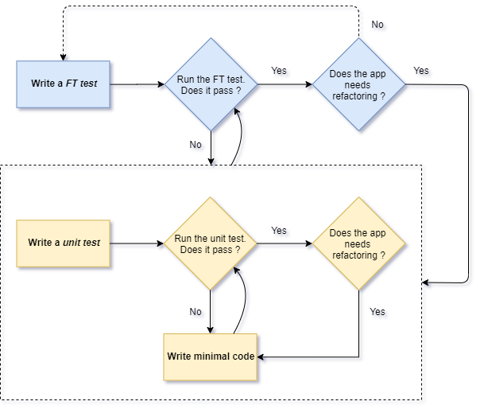

# django-todo-list



Before start, make sure you've done the configuration set listed on section pre [requisites](#pre-requisites). 

## Pre requisites 

* [Configuring the virtual environment](.doc/prerequisites.md#configuring-the-virtual-environment)
* [Web Driver](.doc/prerequisites.md#web-driver)
  * [Chrome `chromedriver` Driver](.doc/prerequisites.md#chromedriver-chrome)
  * [Firefox `geckodriver` Driver](.doc/prerequisites.md#geckodriver-firefox)
* [Create Project](.doc/prerequisites.md#create-project)
* [Create Apps](.doc/prerequisites.md#create-apps)
  * [Adjust `settings.py` in `super`](#.doc/prerequisites.md#adjust-settingspy-in-super)
* [Run Server](.doc/prerequisites.md#run-server)
* [Unit Test Runner](.doc/prerequisites.md#unit-test-runner)

## Development
* [URL Mapping](#url-mapping)
* [HTML Template](#html-template)
---

### URL Mapping

Django uses a file called `urls.py` to map URLs to Views functions. The main `urls.py` is located at super project dir

At the example below, the url path `/` is mapped for view function `main_view`.

```python
from django.contrib import admin
from django.urls import path
from lists.views import main_view

urlpatterns = [
    path('admin/', admin.site.urls),
    path('', main_view, name='main-view')
]
```

### HTML Template

Templates consists of substituting Python variables into HTML text. By default, Django automatically search folders 
called `template` in the app structure `dir`.

```text
create a directory called template in app dir
add a *.html file 
``` 

Adjust the `views.py` to render the proper template when the page loading. 

```python
def main_view(request):
    return render(request, 'main.html')

```
